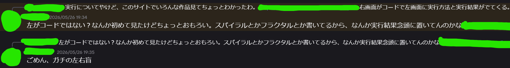

> <cite>わからないけど、なんとかもなってる。なってもらってる。

# 左右盲
という言葉を聞いたことありますか。
雑に調べると、wiki先生が簡単にまとめてくれています。
> 左右の判断や指示が咄嗟には判断できないこと 
> — <cite>Wikipedia(左右識別困難)[^1]</cite>
[^1]: [wikipedia](https://ja.wikipedia.org/wiki/%E5%B7%A6%E5%8F%B3%E8%AD%98%E5%88%A5%E5%9B%B0%E9%9B%A3), July 15, 2026.

私が実はこれで、数年前まで無自覚/そもそもこの概念すら知りませんでした。
それまでは自分の思考回路が周りより遅すぎるせいで左右の判別に時間がかかりすぎているだけだと思っていました。 
そもそもこの考え方からしておかしいんですよね。 
左右をわかっている人を見ていると、左右を判別するプロセスすら無いように見えます。
上下のように当たり前の情報として格納されているのでしょう。

## 感覚
一昔前までは左右どっちかを聞いて判別するまで脳内では以下のことが起こっていました。
1. 左/右を想像しようとする
2. 自分は左利きなので、何かを持つところを想像しようとする
3. ご飯食べる時とかペンを持つシーンを頑張って想像しようとする。その時の調子によってシーンを思い出すまで時間がかかったりかからなかったりする
4. 利き手を思い出し左を導き出す
5. 必要な方向に応じて左のままか左の反対か考えて結びつける 
(6. 思い出しに不備が生じていて左右間違える)

上記の通り、かなり骨の折れる手順が必要かつ時間もかかるしで過ごしていてかなり不便ではあります。 
仕事で左右示す/示された時とかは思考を中断して左右を考える時間が必要になるので急に黙ってしまい相手を驚かせたりもしました。
> 相手がせっかちな人だったりしてどうしても即座に示さなければいけない時、まずは二分の一に賭けてどっちかを指して、相手の反応をみて合っているかどうかを判断するカスのテクニックも生み出しました。

あとステップ6にありますが、普通に間違えます。なんで？ 
特に左右盲であることを知ってからは余裕ある時は手順を最初からやり直して二重確認するときもありますが、それでも間違えます。マジでなんで？

## 対策
もちろんやられっぱなしの自分じゃありません。
何度も使っているうちに覚えるだろうとか、毎日左右を思い出す習慣を取り入れてみました。 
ただ、この問題の一番厄介なところなのですが、**いくら思い出しても頭に知識として結びつかない**んですよね。

例えば数学の勉強をして公式を覚えたりするじゃないですか。その知識ってテストで問題を見るだけで自然とこれ使えばいいんだという風に思い出せることがあるんですよね。正解を知っているわけでもないのに頭が過去の記憶と結びつけて引っ張り出してくれるような。 
これが**一切**起こらないです。 
覚えることを諦める程度には起こらないです。

ただやりようが無いわけじゃありません。 
それなりに長い人生生きてきました。前述のカスのテクニックのような対策をいくつか見つけたり生み出したりしてきました。 
前置きが長くなりましたが、今回はその対策の中でのトップ3を紹介しようと思います。

## 最強ランキング
### 3位 ペン握る
ペンがあれば絶対この方法取ってるくらいには使っていました。 
ペンを使っているシーンを思い出すより直接紙に書けるかどうかみて利き手を判別するほうが圧倒的に早いんですよね。

問題点はペンがなければ使えないところ。

### 2位 腕時計
腕時計は利き手の反対につけるので右が腕時計つけてる方と覚えることができます。 
腕時計は利き手の反対 -> 利き手は左手 -> 利き手の反対は右手 -> 腕時計のつけてるほうが右 
というふうに考える時間はペン握る方法より若干増えますが、ペンより身につけてる時間が長いので二位に。

問題点は腕時計をつけていなければ使えないところ。

### 1位 ???
堂々の一位はある日流れてきた以下のポストを見て知った方法です。

両手でL字を作って、Lと読めるほうが左(<u>**L**</u>eft)なんですよね... 
初めて動画を見た時すごすぎて何が起こったかわからなかったです。文字通り革命でした。 
道具ゼロ、手のみ、判別あり。 
まごうことなき一位です。おめでとうございます。みなさんもぜひ使ってください。

## おわり
めんどいのはありますが、致命的な苦労もなかったので、辛くはないです。 
ただ世の中には左右の判別に時間がかかる人もいるんだナーって知ってくれる人が一人でも増えてくれたら嬉しいです。
もしあなたの使うおすすめの方法があれば是非教えて下さい。ランキングが変わるかもしれません。
それではまた。

愚痴
- 左右って漢字がもう似すぎている、判別させる気概なし。口の左右の棒50%右にずらしただけじゃねぇか。右の棒オーバーフローしてるし。
    - 逆に50%左にずらせば「在」ですね（笑）
- 左は青、右はオレンジのイメージ
- もう指差しでいいだろ。学生時代の視力検査とか左右のせいでいくら落としたと思ってんだ。
    - あと視力検査のCマークに斜めはあるのかないのかどっちなんだよ。それを知ってるか知ってないかで戦略だいぶ変わるだろ
        - 斜めあった
- 「こっちからみて」 <- 難易度爆跳ね。