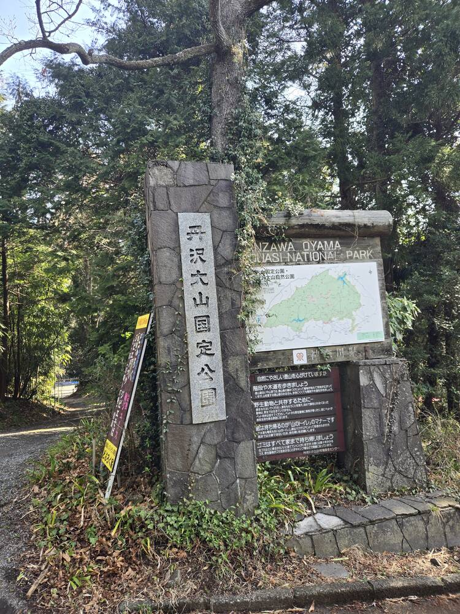
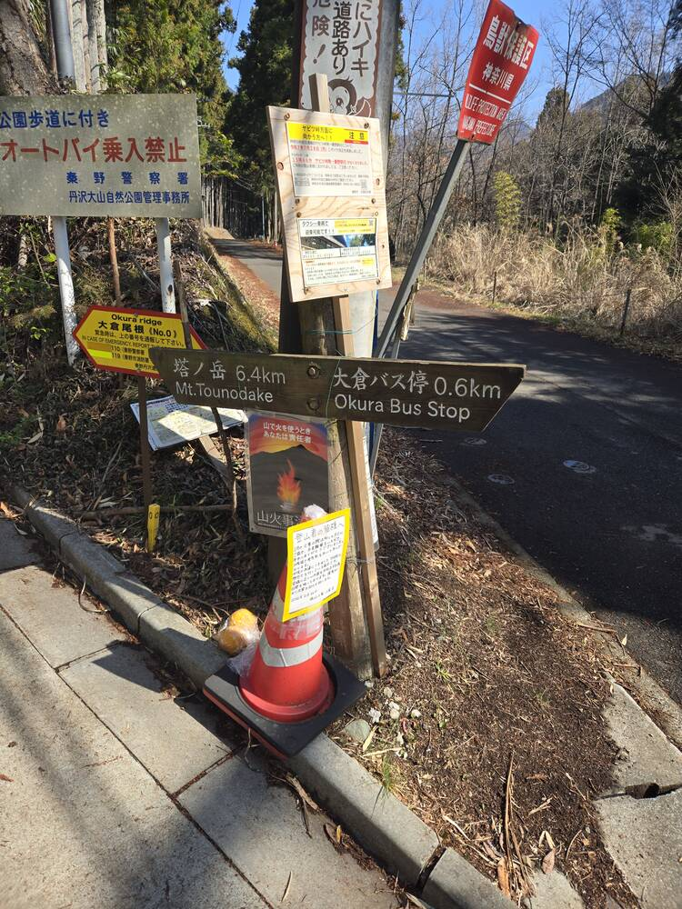
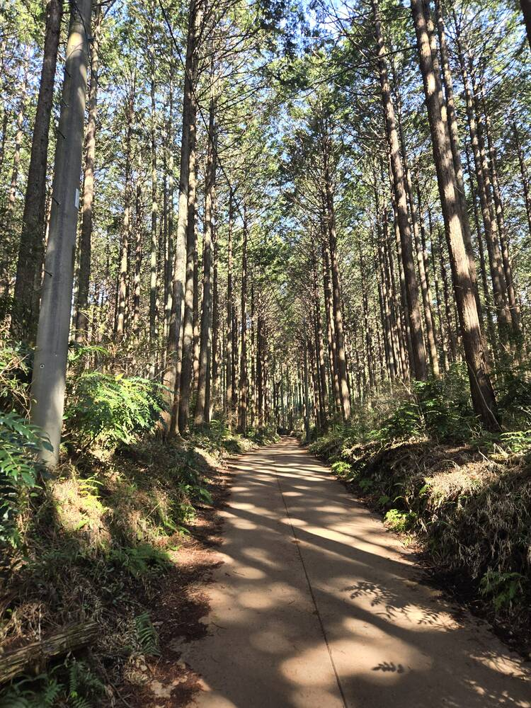
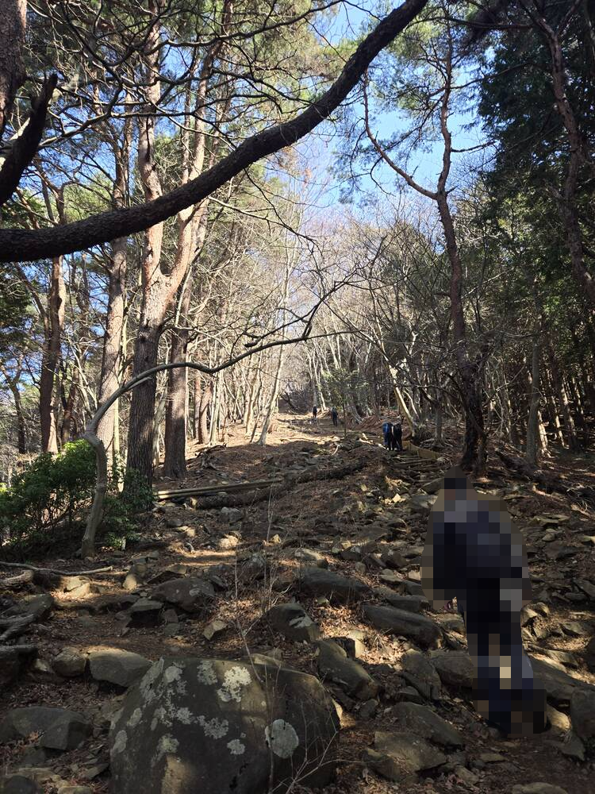
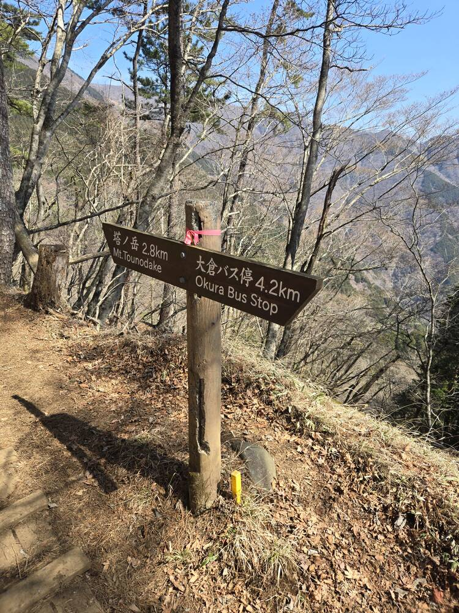
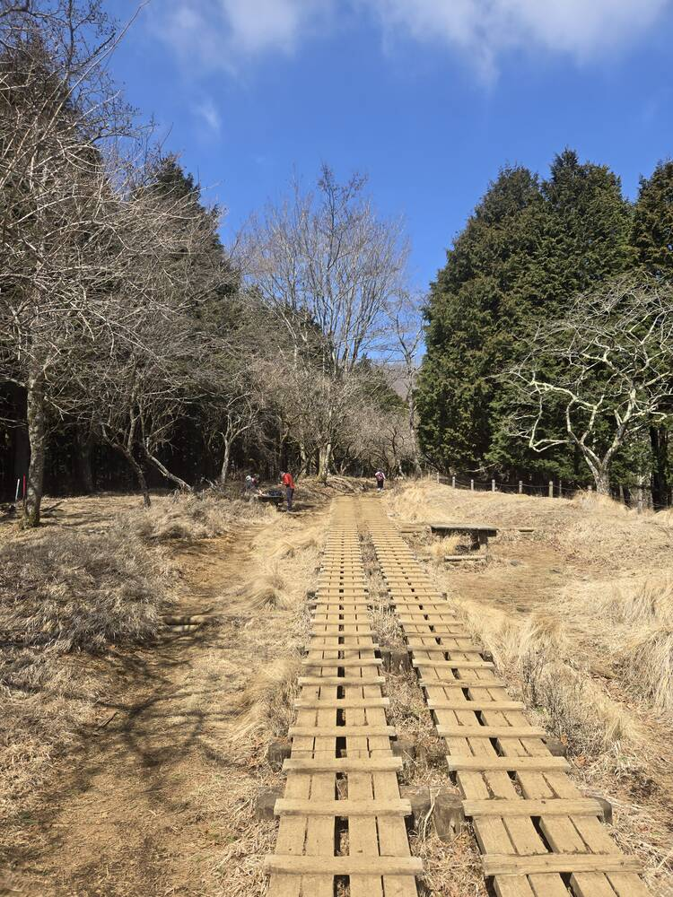
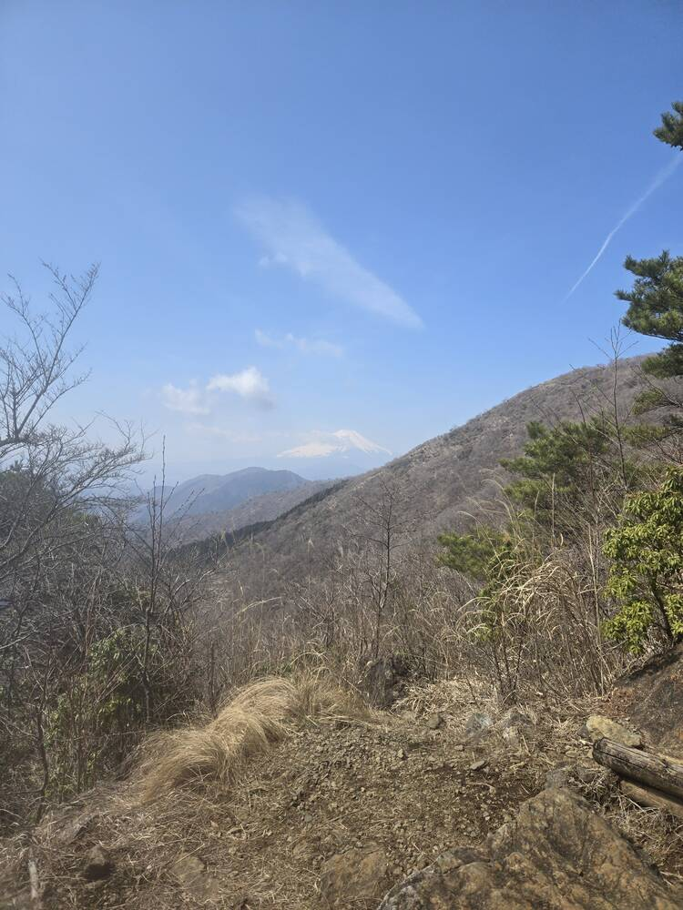
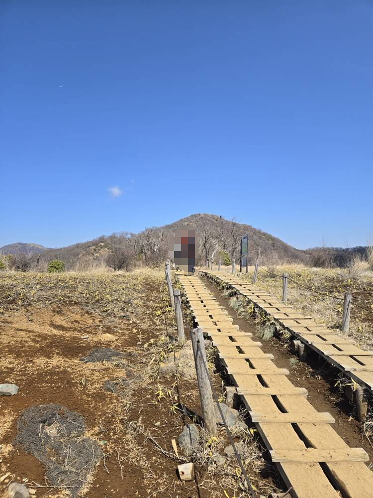
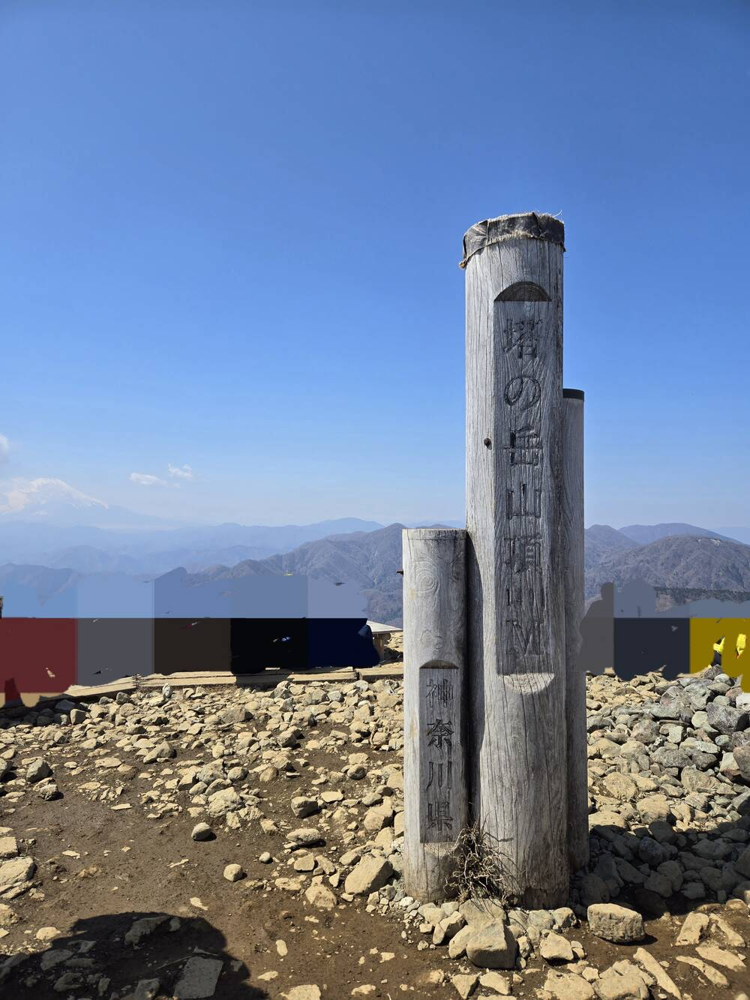
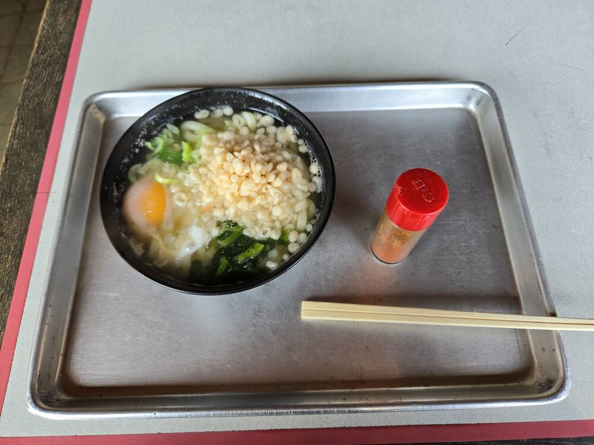

## これまでのあらすじ
1月は高尾山に登り、2月は男体山と女体山(筑波山)を登った。 
上記の山より難易度が高く、富士山がよく見えるとこに登りてーと思い、色々調べて塔ノ岳の存在を知る。

## 登り始め

駅からバスで移動し、少し歩いてから入口っぽいところに到着。

### 入口

看板に従ってそのまま歩いていくと、始まるんだぞっていう感じの雰囲気になる。

割とあるあるだと思うのですが、山の登り始めって明確な境界線が無いせいで、こうなんか、ぬるっと始まる気がします。 
登り始めということもあって、道はかなりきれいに整備されていて歩きやすかったです。

### 段差地獄
それから傾斜が始まり、自然の中をくぐり抜けると、段差の地獄が始まります。

こういう整備されていないタイプの段差と木で出来た整備されている段差が続きます。 
人が登れるであろう段差の量を超える段差が待ってます。 
見上げても終わりが見えないので、最初は考える余裕があったので肝が冷えました。後半になると疲れすぎて、考える余裕も無かったです。

## 中間地点

大体中間くらいの距離まで来て少し気力が回復しました。この時点で体力が3割しか残ってなかったので、登りきれるか心配でした。

登りと登りの間に平坦な道とか下り道があったりします。いい感じに息を整えられる場所です。

ちょっとしてたら、登る目的の一つでもあった富士山が見えるようになってきました。 
景色からして頂上は近いんじゃないかと思っていましたが、まったくそういうことはありませんでした。

残り0.8kmくらいの地点で最後の平坦な道だった気がします。ここを渡りきってからは頂上までひたすら段差を登る道でした。

## 頂上

頂上がやっと視界に入り、息切れしながらラストスパートを登り、下っていくおばあちゃんにすぐそこですよと言われながら、ついに頂上につきました。

感動の頂上! + 富士山 
疲れ切っていたので、とりあえず、いつもの家で作ってきたおにぎりとコーヒーを飲んで、少し休憩してから写真を撮って周っていました。 
土曜日に行ったのですが、思っていたより人はいました。過酷だったので、もっと少ないと思っていました。ただ筑波山より年齢層は明らかに上だったと思います。

## 下り
今まで登った山と違って、下りも少し登ったりするのが印象的でした。 
前回登った筑波山は自然の道が多く、ついつい無理して下ったせいで足を少し痛めましたが、今回はそれが無かったので、成長を感じました。

登りで見かけて気になってたうどんを下りの途中で食べました。名物らしいです。

## まとめ
登り2時間41分 
下り1時間47分

階段がひたすらに多かったのがかなりきつかったです。もう動かないと思うことが何回かありましたが、周りの人が淡々と登っているのを見てやる気を出していました。慣れている人を遠目から観察していたのですが、誰が近くを通っていたりしてもペースを乱されること無く、常に一定の速度で登っているのをみて感心していました。人のペースに巻き込まれたり、道が楽になると、自分のペースが乱されるので、ここは直していきたいです。 
きつい分、頂上の景色は感動しますし、終わってから振り返ってみるとまた登りたくなるような感じさえします。ちなみに、次の日から3日間くらい腹部から下全部が筋肉痛でまともな生活が送れなかったです。 
ちょっと寒いくらいの気温でも水が足りなかったので、夏場だとなおさら過酷になると思います。あと、夏はヒルもかなりいるらしく、入口近くには忘れてきた人のために無料の塩がありました。手厚い。アクセスもそこまで悪くないので良かったら登ってみてください。

それではまた。